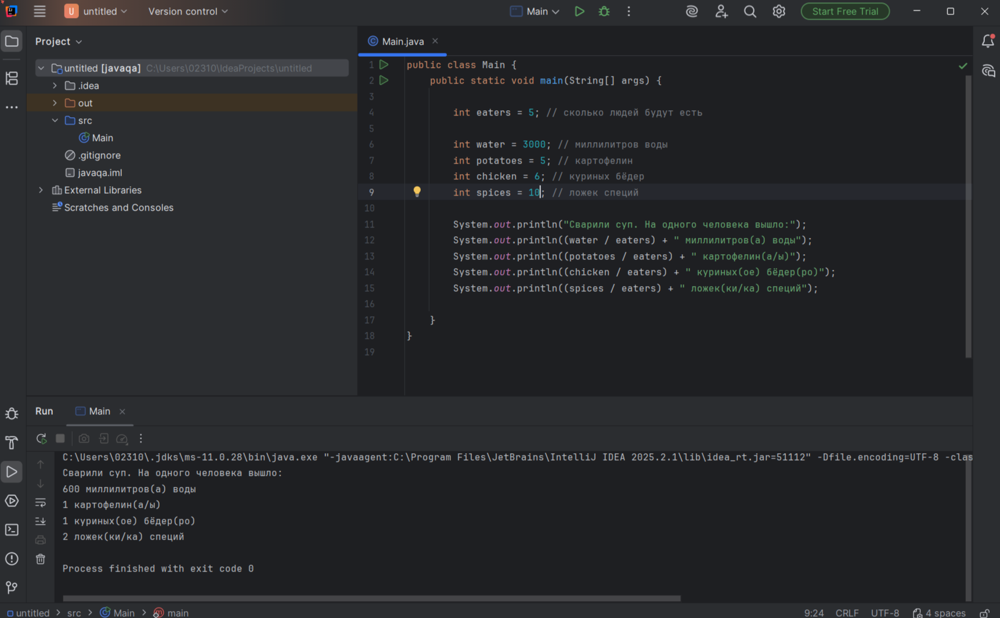

# Описание
При делении куриных бедер на количество порций в рецепте супа программа выдает неверный ответ.

# Локализация дефекта 
https://github.com/Alexander0713/javaqa/blob/3bf49042d74cde40e2d1ea8e2271ba3c484276dc/src/Main.java#L14

# Шаги воспроизведения

1 Открыть код программы в IDEA
2 Вставить значение переменной chicken = 6 (куриных бедер)
3 Вставить значение переменной eaters = 5 (сколько людей будут есть)
4 Запустить программу
5 Посмотреть на вывод консоли

*Ожидаемый результат* Вывод сообщения в строке куриное бедро равное 1,2
*Фактичческий результат* Вывод сообщения в строке куриное бедро равное 1

# Скриншот

# Окружение
Устройство: ПК

Операционная система: Windows 11,

Браузер: Google Chrome Версия: 137.0.7151.120 (Официальная сборка)(64 бит)

JAVA OpenJDK 11